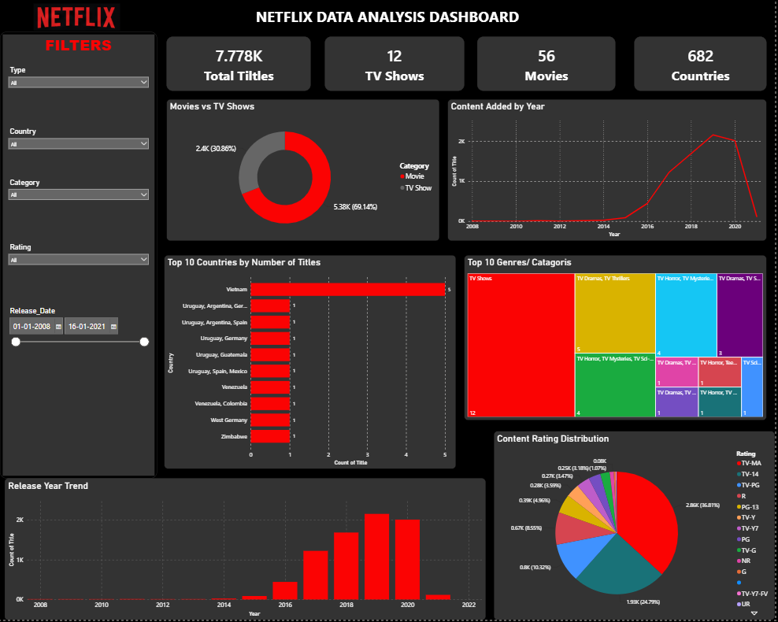

# 🎬 Netflix Data Analysis using Python


---

# 📖 Project Overview

This project analyzes the **Netflix Movies and TV Shows Dataset** using Python to uncover meaningful insights about Netflix's content library. The analysis includes data cleaning, exploratory data analysis (EDA), and visualizations to understand content distribution, genres, ratings, countries, release years, and trends.

---

# 🎯 Objectives

- Clean and preprocess the Netflix dataset.
- Analyze Movies vs TV Shows.
- Find the most common genres.
- Analyze content ratings.
- Identify top contributing countries.
- Study yearly content additions.
- Visualize important trends using charts.

---

# 🛠️ Technologies Used

| Technology | Purpose |
|------------|---------|
| Python | Programming |
| Pandas | Data Cleaning & Analysis |
| NumPy | Numerical Operations |
| Matplotlib | Data Visualization |
| Jupyter Notebook | Development Environment |

---

# 📂 Project Structure

```
Netflix-Data-Analysis/

│
├── Dataset/
│   └── Netflix Dataset.csv
│
├── Notebook/
│   └── Netflix_Analysis.ipynb
│
├── Images/
│   ├── Dashboard.png
│   
├── README.md
│
├── requirements.txt
│
└── .gitignore
```

---

# 📊 Dataset Information

- Dataset Name: Netflix Movies and TV Shows
- Records: 8,000+ Titles
- Features: 12+
- Source: Kaggle

Dataset includes:

- Show ID
- Type
- Title
- Director
- Cast
- Country
- Date Added
- Release Year
- Rating
- Duration
- Genre
- Description

---

# 📈 Analysis Performed

✔ Data Cleaning

✔ Missing Value Handling

✔ Duplicate Removal

✔ Movies vs TV Shows Analysis

✔ Rating Distribution

✔ Country-wise Content Analysis

✔ Genre Analysis

✔ Release Year Analysis

✔ Content Added Per Year

✔ Data Visualization

---

# 📷 Project Output

## Dashboard

> Add your dashboard screenshot here.



---


# 📌 Key Insights

- Movies significantly outnumber TV Shows.
- United States contributes the highest number of Netflix titles.
- TV-MA is the most common content rating.
- Netflix content increased rapidly after 2016.
- Drama and International Movies are among the most popular genres.

---

# 🚀 Installation

Clone the repository

```bash
git clone https://github.com/Esha0Shaw/VOIS_AICTE_Oct2025_MajorProject_EshaShaw.git
```

Move into project folder

```bash
cd Netflix-Data-Analysis
```

Install required libraries

```bash
pip install -r requirements.txt
```

Launch Jupyter Notebook

```bash
jupyter notebook
```

Open

```
Netflix_Analysis.ipynb
```

Run all cells.

---

# 📋 requirements.txt

```
pandas
numpy
matplotlib
jupyter
notebook
openpyxl
```

---

# 📌 Future Improvements

- Interactive Power BI Dashboard
- Tableau Dashboard
- Sentiment Analysis
- Recommendation System
- Machine Learning Prediction
- Streamlit Web Application

---

# 👩‍💻 Author

**Esha Shaw**

📧 Email: *Your Email*

🔗 LinkedIn: https://www.linkedin.com/in/esha-shaw-956386281

💻 GitHub: https://github.com/Esha0Shaw

---

# ⭐ Support

If you found this project useful, please consider giving it a ⭐ on GitHub.
